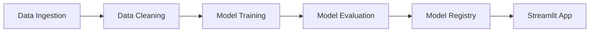

# 🏥 AI Medical Diagnosis System

A production-grade Machine Learning pipeline designed to assist in preliminary medical diagnosis based on patient symptoms. Built with **ZenML**, **MLflow**, **Streamlit**, and **Scikit-learn**, this project demonstrates how to build robust, scalable, and deployable ML systems for healthcare applications.

> [!WARNING]
> **Disclaimer**: This tool is for **educational and research purposes only**. It is **not** a substitute for professional medical advice, diagnosis, or treatment. Always consult with a qualified healthcare provider for medical concerns.


---

## 📋 Table of Contents

- [Overview](#-overview)
- [Key Features](#-key-features)
- [Architecture](#-architecture)
- [Project Structure](#-project-structure)
- [Installation Guide](#-installation-guide)
- [Usage Instructions](#-usage-instructions)
- [Technical Details](#-technical-details)
- [Troubleshooting](#-troubleshooting)

---

## 🔭 Overview

This project implements an End-to-End Machine Learning pipeline that:
1.  **Ingests** medical data (symptoms descriptions).
2.  **Cleans and Preprocesses** the data for machine learning.
3.  **Trains** a Random Forest Classifier to map symptoms to diseases.
4.  **Evaluates** the model's accuracy.
5.  **Deploys** a user-friendly Web Interface using Streamlit for real-time predictions.

It is designed to be easily extensible, allowing data scientists to swap out models, data sources, or preprocessing steps without rewriting the entire codebase.

---

## ✨ Key Features

- **Automated Pipeline**: A fully automated workflow using ZenML to manage data, training, and evaluation steps.
- **Experiment Tracking**: Integrated with **MLflow** to track model metrics, parameters, and artifacts.
- **Interactive UI**: A built-in **Streamlit** application allows users to select symptoms and get instant predictions.
- **Robust Engineering**: Uses software design patterns (Factory, Strategy, Template) for clean, maintainable code.
- **Scalable**: Ready for deployment in cloud environments.

---

## 🏗️ Architecture

The system follows a modular MLOps architecture:



1.  **Ingestion**: Reads raw data from `data/medical_data.zip`.
2.  **Cleaning**: Handles missing values and outliers.
3.  **Training**: Uses a **Random Forest Classifier** (`src/model_dev.py`).
4.  **Evaluation**: Calculates accuracy and logs metrics to MLflow.
5.  **Serving**: The Streamlit app loads the latest trained model from the artifact store to make predictions.

---

## 📁 Project Structure

Here is a roadmap of the repository to help you navigate:

```
prices-predictor-system/        # (Root directory)
├── README.md                   # You are here!
├── run_pipeline.py             # Script to trigger the Training Pipeline
├── streamlit_app.py            # The Medical Diagnosis Web Application
├── requirements.txt            # Python dependencies
├── config.yaml                 # Configuration settings
│
├── pipelines/                  # ZenML Pipeline definitions
│   └── training_pipeline.py    # Orchestrates ingestion -> training -> eval
│
├── steps/                      # Individual steps of the pipeline
│   ├── clean_data.py           # Preprocessing logic
│   ├── model_train.py          # Training logic
│   └── evaluation.py           # Model assessment
│
├── src/                        # Core Logic & Classes
│   ├── model_dev.py            # Model definitions (RandomForest)
│   └── ...
│
└── data/                       # Dataset storage
    └── medical_data.zip        # Raw medical dataset
```

---

## 🚀 Installation Guide

Follow these steps to set up the project on your local machine.

### Prerequisites
- **Python 3.8** or higher installed.
- **Git** installed.

### Step 1: Clone the Repository
```bash
git clone https://github.com/your-username/medical-diagnosis-system.git
cd prices-predictor-system
```

### Step 2: Create a Virtual Environment
It's best practice to isolate your dependencies.
```bash
# Windows
python -m venv venv
venv\Scripts\activate

# macOS/Linux
python3 -m venv venv
source venv/bin/activate
```

### Step 3: Install Dependencies
```bash
pip install -r requirements.txt
```

### Step 4: Initialize ZenML
```bash
zenml init
```

---

## 💻 Usage Instructions

### 1. Train the Brain (Run the Pipeline)
Before you can use the app, you need to train the AI model.
```bash
python run_pipeline.py
```
**What happens?**
- The script initializes the `training_pipeline`.
- It processes the data in `data/medical_data.zip`.
- It trains a new model and saves it.
- Check the terminal output for success messages!

### 2. Launch the Web App
Interact with the trained model using the dashboard.
```bash
streamlit run streamlit_app.py
```
- A browser window will open (usually `http://localhost:8501`).
- **Instructions**:
    1.  Select symptoms from the sidebar/main menu (e.g., Fever, Cough).
    2.  Click **"Analyze Symptoms"**.
    3.  See the predicted diagnosis result.

### 3. Visualizing Experiments (MLflow)
To see technical details like model accuracy and training history:
```bash
mlflow ui
```
- Open `http://localhost:5000` in your browser.

---

## 🔧 Technical Details (For Developers)

### Design Patterns
This project uses solid software engineering principles:
- **Strategy Pattern**: Used in `src/model_dev.py` to allow easy swapping of algorithms (e.g., switching from Random Forest to XGBoost without breaking the pipeline).
- **Factory Pattern**: Used for data ingestion to handle different file formats automatically.

### Configuring the Model
You can modify the model parameters in `src/model_dev.py`. Look for:
```python
model = RandomForestClassifier(n_estimators=100, random_state=42)
```
Change `n_estimators` or add other hyperparameters to tune performance.

---

## ❓ Troubleshooting

**Q: The Streamlit app says "AI Brain Offline".**
> **Fix**: You must run the training pipeline first (`python run_pipeline.py`). The app needs a trained model to make predictions.

**Q: `ModuleNotFoundError`?**
> **Fix**: Ensure your virtual environment is activated and you have installed all requirements: `pip install -r requirements.txt`.

**Q: ZenML Errors?**
> **Fix**: Try resetting the stack:
> ```bash
> zenml clean
> zenml init
> ```

---

## 🤝 Contributing
Contributions are welcome! If you'd like to improve the model or add new features:
1.  Fork the repo.
2.  Create a feature branch.
3.  Submit a Pull Request.

---

**Built with ❤️ for AI in Healthcare**
